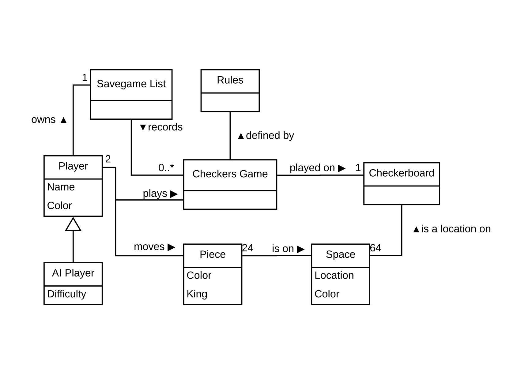
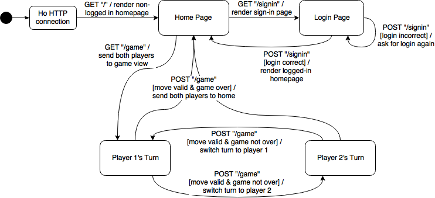

# WebCheckers Design Documentation

> The following template provides the headings for your Design Documentation.  As you edit each section make sure you remove these commentary 'blockquotes'; the lines that start with a > character.

# Team Information
* Team name: Group 🅱️
* Team members
  * Andrew Reed
  * Curtis Veronesi
  * Peter Fabinski
  * Adam Heeter

## Executive Summary

This is a summary of the project.

### Purpose
> Provide a very brief statement about the project and the most important user group and user goals.

### Glossary and Acronyms
> Provide a table of terms and acronyms.

| Term | Definition |
|------|------------|
| VO | Value Object |

## Requirements

This section describes the features of the application.

> In this section you do not need to be exhaustive and list every story.  Focus on top-level features from the Vision document and maybe Epics and critical Stories.

### Definition of MVP
> Provide a simple description of the Minimum Viable Product.

### MVP Features
> <b>Player Sign-in</b>
> > As a Player I want to sign-in so that I can play a game of checkers.

> <b>Start a Game</b>
> > As a Player I want to start a game so that I can play checkers with an opponent.

> <b>Start a Game</b>
> > As a Player I want to start a game so that I can play checkers with an opponent.

> <b>Epic: Piece Movement</b>
> > As a Player I want to play a game of checkers so that I have fun.

> > <b>Allowed Spaces</b>
> > > As a Player I want to get feedback when I drag a piece so that I know where I am allowed to put it down.

> > <b>Piece Capture</b>
> > > As a Player I want to capture the other player's pieces so that I can progress in the game.

> > <b>Forced Moves</b>
> > > As a Player I want to be informed when I am required to make a move so that I don’t try to make a different move than I need to.

> <b>Epic: Game State</b>
> > The player needs to know the state of the game and what they can do next.

> > <b>Game Endings </b>
> > > As a Player I want to know when the game is over so that I don't try to continue playing.

### Roadmap of Enhancements

> <b>Epic: Save Management</b>
> > The player must be able to choose when they want to save a game and look at them later.

> > <b>Listing Saved Games</b>
> > > As a Player I want to view the games which I have saved so that I can choose which one to watch.

> > <b>Saving a Game</b>
> > > As a Player I want to decide, at the end of a game, to save it so that I can review it at a later date.

> > <b>Deleting a Game</b>
> > > As a Player I want to delete a game I have saved so that it does not clutter up my list of saved games.

> <b>Epic: Artificial Intelligence</b>
> > As a Player I want to play against a computer player so that I can play checkers without needing another player to play against.

> > <b>Movement</b>
> > > As an AI I want to move checkers so that the game can be played.

> > <b>Location Take Over</b>
> > > As an AI I want to take positions so that I can win.

> > <b>AI Learning</b>
> > > As an AI I want to Learn from mistakes so that I can win every game.

> > <b>Easy AI Extra</b>
> > > As an easy AI I want to make jokes so that the player is entertained.

> > <b>Player Selection </b>
> > > As a Player I want to choose an AI so that I can play a game of checkers against it.

> <b>Epic: Watching a Saved Game</b>
> > The player must be able to pick a saved game and watch the playthrough.

> > <b>Viewing a Game</b>
> > > As a Player I want to see the replayed game in a similar setting to where it was played originally so that I can easily track the movements and game status.

> > <b>Play and Pause</b>
> > > As a Player I want to pause and resume watching a replay game so that I can stop to analyze a position or practice my own playing.

> > <b>Speed Controls</b>
> > > As a Player I want to control the speed of playback of a game so that I can slow it down and look carefully or go quickly through and get the basic idea of the game.

> > <b>Player Information</b>
> > > As a Player watching a game, I want to be told the names of each player in the game so that I know who I am watching.

## Application Domain

This section describes the application domain.

> Replace the placeholder image above with your team's own domain model. 

> Provide a high-level overview of the domain for this application. You can discuss the more important domain entities and their relationship to each other.

## Architecture

This section describes the application architecture.

### Summary

The following Tiers/Layers model shows a high-level view of the webapp's architecture.

As a web application, the user interacts with the system using a browser.  The client-side
of the UI is composed of HTML pages with some minimal CSS for styling the page.  There is also
some JavaScript that has been provided to the team by the architect.

The server-side tiers include the UI Tier that is composed of UI Controllers and Views.
Controllers are built using the Spark framework and View are built using the FreeMarker framework.  The Application and Model tiers are built using plain-old Java objects (POJOs).

Details of the components within these tiers are supplied below

### Overview of User Interface

This section describes the web interface flow; this is how the user views and interacts
with the WebCheckers application.

> Replace the placeholder image above with your team's own web interface state model. 

> Provide a summary of the application's user interface.  Describe, from the user's perspective, the flow of the pages in the web application.

### UI Tier
> Provide a summary of the Server-side UI tier of your architecture.
> Describe the types of components in the tier and describe their responsibilities.

#### Static models
> Provide one or more static models (UML class or object diagrams) with some details such as critical attributes and methods.

#### Dynamic models
> Provide any dynamic models, such as state and sequence diagrams, as is relevant to a particularly significant user story.
> For example, in WebCheckers you might create a sequence diagram of the `POST /validateMove` HTTP request processing or you might use a state diagram if the Game component uses a state machine to manage the game.

### Application Tier
> Provide a summary of the Application tier of your architecture.
> Describe the types of components in the tier and describe their responsibilities.

#### Static models
> Provide one or more static models (UML class or object diagrams) with some details such as critical attributes and methods.

#### Dynamic models
> Provide any dynamic model, such as state and sequence diagrams, as is relevant to a particularly significant user story.

### Model Tier
> Provide a summary of the Model tier of your architecture.
> Describe the types of components in the tier and describe their responsibilities.

#### Static models
> Provide one or more static models (UML class or object diagrams) with some details such as critical attributes and methods.

#### Dynamic models
> Provide any dynamic model, such as state and sequence diagrams, as is relevant to a particularly significant user story.
