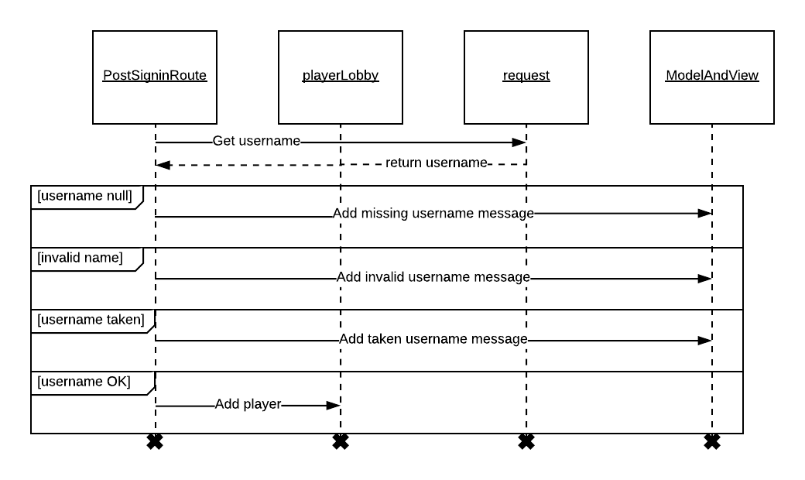
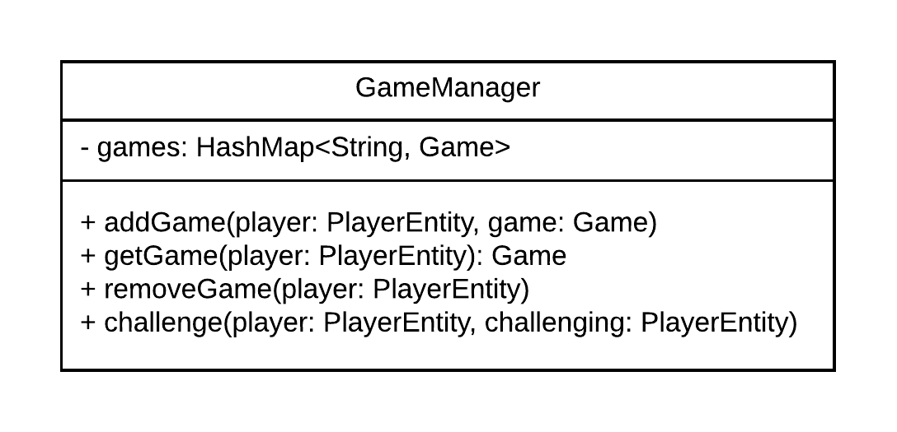
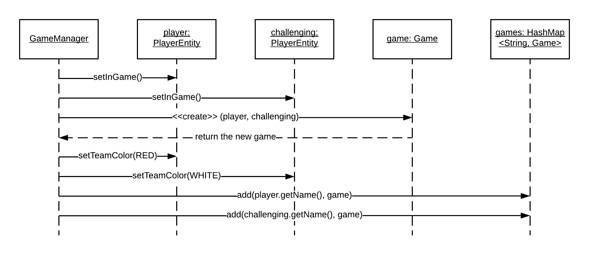
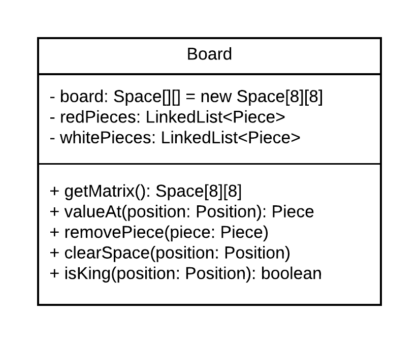
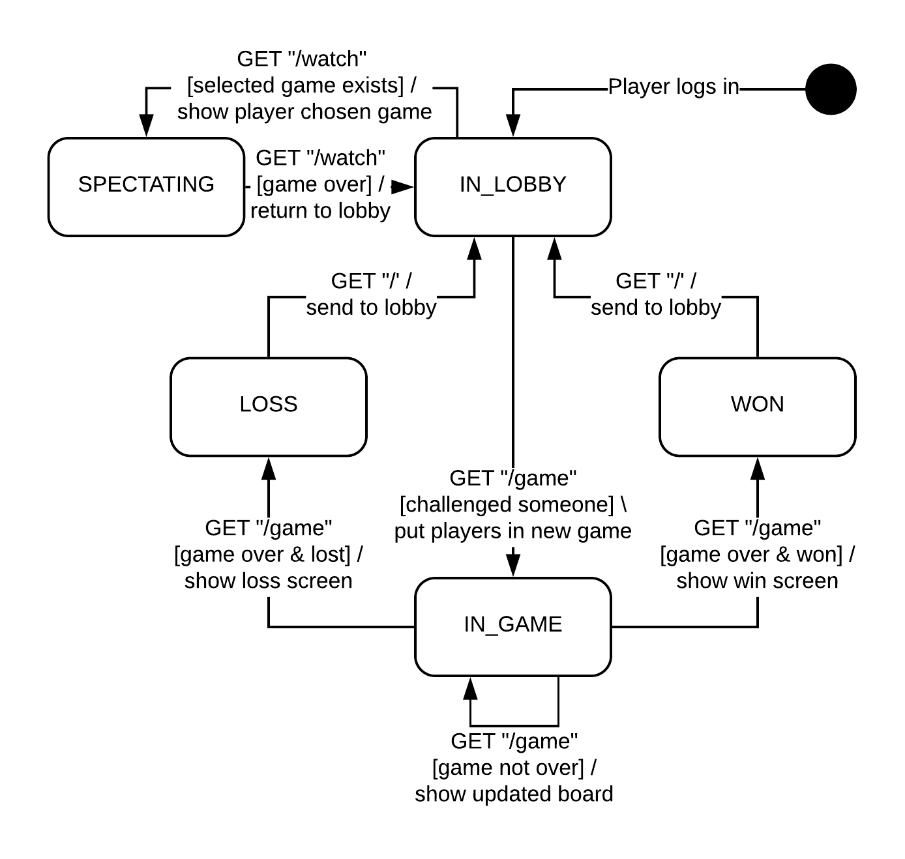
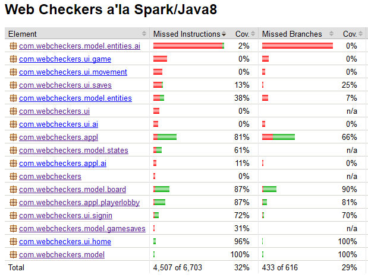
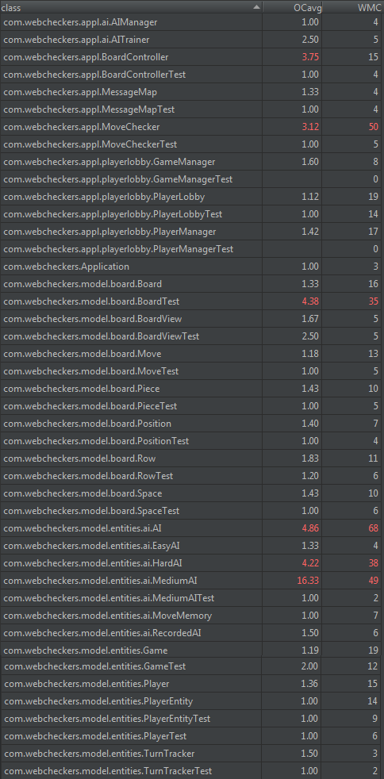
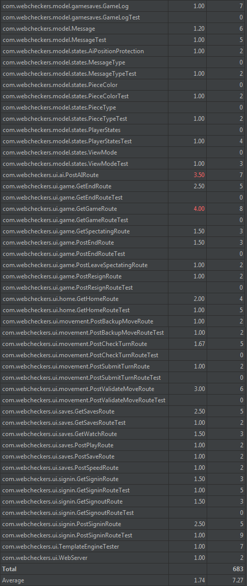

# WebCheckers Design Documentation

# Team Information
* Team name: Group "B emoji"
* Team members
  * Andrew Reed
  * Curtis Veronesi
  * Peter Fabinski
  * Adam Heeter

# Executive Summary

WebCheckers is a platform designed for players to link up and play checkers online. Players get to choose to either to play against an Artificial Intelligence or to choose from a list of active players that are not in a game. After choosing the type of game to play, the user is brought to a screen with the board shown on it, and their opponent also is brought to the same game but from the opposite perspective. From there, they will continue to play the game while being held to the rules of the game. Lastly, players will be able to save and re-watch games they have played in the past.

## Purpose

WebCheckers is a platform for users to come and play checkers online with either their friends or an artificial intelligence.

Our user group includes:

* Parents and children, who want to add more fun to game night. 
* Groups of friends, who are looking for something fun to play.

# Requirements

This section describes the features of the application.

## Definition of MVP

For this project, the minimum viable product is the capability to play a complete game of checkers. This involves signing in, starting a game, viewing the board, moving pieces, capturing the opponent's pieces, and finally, finishing the game by winning, losing, resigning, or getting a tie.

## MVP Features

* Player Sign-in

  * As a Player, I want to sign-in so that I can play a game of checkers.
  
* Start a Game

  * As a Player, I want to start a game so that I can play checkers with an opponent.

* Epic: Piece Movement

  * As a Player, I want to move pieces to play a game of checkers so that I have fun.

* Epic: Game State

  * As a Player, I need to know the state of the game and what I can do next.
  
  * Game Endings
  
    *  As a Player, I want to know when the game is over so that I don't try to continue playing.

## Roadmap of Enhancements

* Epic: Artificial Intelligence

  * As a Player, I want to play against a computer player so that I can play checkers without needing another person to play against.
  
  * Piece Movement
  
    * As an AI, I want to be able to move pieces like a human player so that I can play checkers.

  * AI Learning

    * As an AI, I want to learn from mistakes so that I can win every game.

  * Player Selection 

    * As a Player, I want to choose an AI so that I can play a game of checkers against it.
	
* Epic: Game Saves

  * Save Management

    * As a Player, I want to save games and then look at them later.

  * Watching a Saved Game

    * As a Player, I want to choose a saved game and watch the play-through.
    
	* As a Player, I want to pause and resume watching a replay game so that I can stop to analyze a position or think about my own next move.

    * As a Player watching a game, I want to be told the names of each player in the game so that I know who I am watching.

# Application Domain

This section describes the application domain.

WebCheckers is based primarily upon individual games of checkers, each having a board and two players. A game and its players are linked together via the player lobby, which maintains lists of all games and logged-in users.

The checkers board contains 64 spaces of alternating colors, and each player's pieces can be placed on the dark squares of the board. Each player has 12 pieces; one player has red pieces, and the other player has white pieces. When moving pieces, the players are restricted by the rules of Checkers, which dictate where they are allowed to move and what actions they can take. When a game is complete, either player can decide to save the game to their savegame list to rewatch it at a later date.

# Architecture

This section describes the application architecture.

## Summary

The following Tiers/Layers model shows a high-level view of the webapp's architecture.

As a web application, the user interacts with the system using a browser.  The client-side
of the UI is composed of HTML pages with some minimal CSS for styling the page.  There is also
some JavaScript that has been provided to the team by the architect.

The server-side tiers include the UI Tier that is composed of UI Controllers and Views.
Controllers are built using the Spark framework and View are built using the FreeMarker framework.  The Application and Model tiers are built using plain-old Java objects (POJOs).

Details of the components within these tiers are supplied below.

## Overview of User Interface

This section describes the web interface flow; this is how the user views and interacts
with the WebCheckers application.

When the user first logs in, they are directed to the home page, which will show them the total number of online players, as well as a link to the sign in page. When they click the link to sign in, they see a text box where they can enter a username. If the username is taken or invalid, they will see a message and be directed back to the sign in page. If they enter a valid, unused username, they will be sent back to the home page with a link to sign out and a full list of players' usernames. When they click on another user, if they are not in a game already, the two players will be placed in a game together and sent to the Game page. Until the game is over, it alternates between being the red and white player's turn, verifying each move before it is submitted.

## UI Tier
The UI tier of the architecture is composed primarily of Spark routes, using the FreeMarker template engine. 

These routes take web requests from the client, perform the required actions (such as signing the user in), and then return HTML for the requested web page. To generate this HTML, FreeMarker templates are used, which allow the pages to be modified based on the state of the application and the user's information.

### Static models
As the below class diagram shows, the PostSigninRoute class has a FreeMarker template engine; when it is called, the messages for the login status are rendered and shown appropriately using the template.

### Dynamic models
As the below sequence diagram shows, the PostSigninRoute class creates a model and view for the FreeMarker renderer to use. Using the attributes in the model and view, the renderer creates an HTML page with the correct information based on the user's input.

## Application Tier
In the Application tier, our architecture has several classes which oversee the functionality of the application.

One of the most important parts of our Application tier is the GameManager class. This component holds a map relating players' usernames to the games they are participating in.
The Application tier also contains some utility components; for example, the BoardController class has various methods to set up an initial game board, move pieces, and get piece information from the board which it is given.

### Static models

The above UML class diagram shows the methods and attributes of PlayerLobby, which are used to keep track of each signed-in player and in-progress game.

### Dynamic models

As the below sequence diagram demonstrates, the GameManager class is used in order for one player to challenge another to a game of checkers. Both players' states are set to be in a game, a new game is created, and the game is added to the map for each player.

## Model Tier
The Model tier of our architecture contains the basic structures representing a checkers game and its players.

For example, there is the Board class. This structure holds every space on the checkers board; in these spaces, checkers pieces can be placed and moved to represent the game taking place.

### Static models

As the below partial class diagram below shows, the board itself has little responsibility other than holding pieces and providing their basic information. All placement logic and game initialization is handled separately in the BoardController class, in the Application tier.

### Dynamic models

As the above statechart demonstrates, the PlayerEntity class is state-based, and has five possible states. Both AI and real players extend this class, so they also have each of these states. Transitions between states are caused by various actions by the players, or by changes in the game's status; for example, if a player GETs the game page, but the game has ended, they will be placed into either the WON or LOSS states depending on who won the game.

# Code Coverage

The below figure shows combined code coverage statistics for all three tiers. (Due to our use of subpackages, the pages for the ui/appl/model packages themselves are not accurate representations of those tiers' coverage, because they do not include the subpackages' statistics.)

As the statistics show, our code coverage for Sprint 3 was very low, at only 32%. This was primarily due to poor time management, as well as focusing too much on getting the maximum number of enhancement features working instead of creating tests for the already-written features.

For the Model tier, some classes are relatively well-tested; because they did not change very much from the last sprint, not much needed to be done to update the tests. This can be seen especially in the board package, which contains most of the representative classes such as Board, Piece, and Move. As the figure shows, this subpackage has 87% code coverage.

In both the Model and Application tiers, there is almost no coverage for any of the AI-related classes. This is due to the way the AIs are created, which necessitates an enormous number of branches and decision-making logic which is practically impossible to test thoroughly.

For the UI tier, the classes which were carried over from the last sprint are still quite well-tested; for example, the GetHomeRoute, GetSigninRoute, and PostSigninRoute classes all have over 80% coverage. However, none of the new UI-tier classes have any tests written for them; this is due simply to poor planning.

# Code Metrics

The following two figures show the code metrics for all classes in the project.

As the metrics show, there are 8 classes which exceed the complexity target of 3.0. First is BoardController, specifically its getPieceLocation method. Currently, this method uses nested loops to check every space on the board, comparing the piece in that location to the desired piece. To make this piece of code more efficient, one possible solution could be to store a piece's position in the Piece object; then, to find a position given a piece, it would only be necessary to iterate through the respective list of pieces (red or white) and compare those. This would be much better, as it not only eliminates the need for nesting loops, it also avoids checking empty spaces on the board.

Next is the MoveChecker class, with a complexity metric of 3.12. The most complex method in this class is hasJumpMove; again, this method uses nested loops, checking every possible movement from the current position to see if it is valid and a jump. There are two ways this method could be simplified; first, the loops currently iterate over all moves up to 6 squares from the current position. With some simple calculations, this could be greatly reduced to only check movements which would remain on the board (which is now done inside the loop). Another way the method could be improved is to make use of the hasValidMove method at the start; this would eliminate the need to run the loops at all if there aren't any valid moves at all. The hasValidMove method is also over the complexity target, due to its nested loops; this could also be improved in the same way as hasJumpMove, by calculating which positions would be on the board before starting the loops.

The rest of the methods in MoveChecker are over the complexity target primarily due to their large numbers of if statements to check various aspects of move validity. This is much harder to avoid; in these other methods, the complexity is probably justified, simply due to the large number of checks which need to be made in order to match only valid moves and reject all others.

Next is the BoardTest class, which has a complexity of 4.38. This complexity is also hard to avoid; the related methods are for testing the BoardView creation, and to verify that the iterators returned are the same, it is necessary to check each of their elements. This results in two nested loops, simply because the iterators are nested and have no equality check. This could be remedied by allowing the tests access to the underlying lists, which would enable a much simpler comparison. 

The next class we will analyze is the GetGameRoute class, with a complexity rating of 4.0. The most significant item in this class is the five different checks for the user's current state, which are used to redirect them somewhere else if they are not supposed to be in the game view (for example, if they have lost). There is not much which can be done about this; the complexity of this class seems justified, because the user does need to be sent to various other pages depending on their state. A possible improvement could be to use case statements instead of the if statements, and allow direct access to the player's state instead of checking it through various boolean methods. Other than that, though, there is not a lot which can be done about this class.

The PostAIRoute class is in a very similar situation, with a complexity of 3.5. However, this class would be much simpler to convert to a switch structure; all of its if statements are comparing the AI type to specific strings, which is the perfect application for a switch and cases.

Finally are the three AI classes; AI, HardAI, and MediumAI. In all of these classes, the complexity is justified. Even in the clear outlier case of MediumAI, which has a complexity over 16, the many method paths are required; because of all the possible states the game could have, there are an enormous number of aspects which need to be checked to determine the best move to make. In order to make the code cleaner and more readable, some of the logic could certainly be separated out into smaller methods (with documentation!), but ultimately, the total amount of logic and checks in the AI classes is unavoidable.

