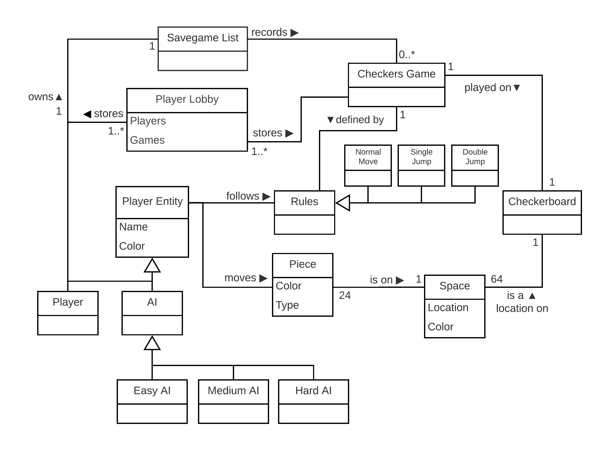
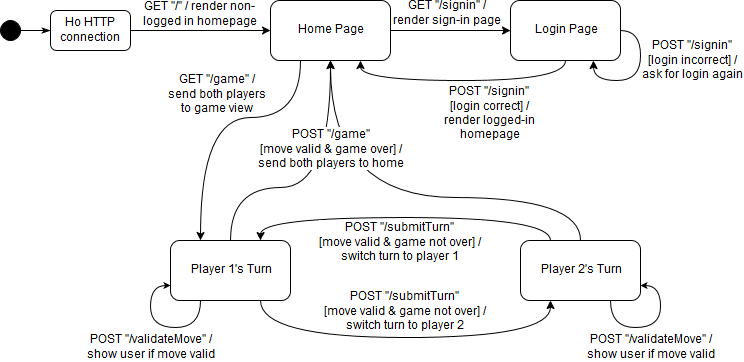

# WebCheckers Design Documentation

# Team Information
* Team name: Group "B emoji"
* Team members
  * Andrew Reed
  * Curtis Veronesi
  * Peter Fabinski
  * Adam Heeter

# Executive Summary

WebCheckers is a platform designed for players to link up and play checkers online. Players get to choose to either to play against an Artificial Intelligence or to choose from a list of active players that are not in a game. After choosing the type of game to play, the user is brought to a screen with the board shown on it, and their opponent also is brought to the same game but from the opposite perspective. From there, they will continue to play the game while being held to the rules of the game. Lastly, players will be able to save and re-watch games they have played in the past.

## Purpose

WebCheckers is a platform for users to come and play checkers online with either their friends or an artificial intelligence.

Our user group includes:

* Parents and children, who want to add more fun to game night. 
* Groups of friends, who are looking for something fun to play.

# Requirements

This section describes the features of the application.

## Definition of MVP

For this project, the minimum viable product is the capability to play a complete game of checkers. This involves signing in, starting a game, viewing the board, moving pieces, capturing the opponent's pieces, and finally, finishing the game by winning, losing, resigning, or getting a tie.

## MVP Features

* Player Sign-in

  * As a Player, I want to sign-in so that I can play a game of checkers.
  
* Start a Game

  * As a Player, I want to start a game so that I can play checkers with an opponent.

* Epic: Piece Movement

  * As a Player, I want to move pieces to play a game of checkers so that I have fun.

* Epic: Game State

  * As a Player, I need to know the state of the game and what I can do next.
  
  * Game Endings
  
    *  As a Player, I want to know when the game is over so that I don't try to continue playing.

## Roadmap of Enhancements

* Epic: Artificial Intelligence

  * As a Player, I want to play against a computer player so that I can play checkers without needing another person to play against.
  
  * Piece Movement
  
    * As an AI, I want to be able to move pieces like a human player so that I can play checkers.

  * AI Learning

    * As an AI, I want to learn from mistakes so that I can win every game.

  * Player Selection 

    * As a Player, I want to choose an AI so that I can play a game of checkers against it.
	
* Epic: Game Saves

  * Save Management

    * As a Player, I want to save games and then look at them later.

  * Watching a Saved Game

    * As a Player, I want to choose a saved game and watch the play-through.
    
	* As a Player, I want to pause and resume watching a replay game so that I can stop to analyze a position or think about my own next move.

    * As a Player watching a game, I want to be told the names of each player in the game so that I know who I am watching.

# Application Domain

This section describes the application domain.

WebCheckers is based primarily upon individual games of checkers, each having a board and two players. A game and its players are linked together via the player lobby, which maintains lists of all games and logged-in users.

The checkers board contains 64 spaces of alternating colors, and each player's pieces can be placed on the dark squares of the board. Each player has 12 pieces; one player has red pieces, and the other player has white pieces. When moving pieces, the players are restricted by the rules of Checkers, which dictate where they are allowed to move and what actions they can take. When a game is complete, either player can decide to save the game to their savegame list to rewatch it at a later date.

# Architecture

This section describes the application architecture.

## Summary

The following Tiers/Layers model shows a high-level view of the webapp's architecture.

As a web application, the user interacts with the system using a browser.  The client-side
of the UI is composed of HTML pages with some minimal CSS for styling the page.  There is also
some JavaScript that has been provided to the team by the architect.

The server-side tiers include the UI Tier that is composed of UI Controllers and Views.
Controllers are built using the Spark framework and View are built using the FreeMarker framework.  The Application and Model tiers are built using plain-old Java objects (POJOs).

Details of the components within these tiers are supplied below.

## Overview of User Interface

This section describes the web interface flow; this is how the user views and interacts
with the WebCheckers application.

When the user first logs in, they are directed to the home page, which will show them the total number of online players, as well as a link to the sign in page. When they click the link to sign in, they see a text box where they can enter a username. If the username is taken or invalid, they will see a message and be directed back to the sign in page. If they enter a valid, unused username, they will be sent back to the home page with a link to sign out and a full list of players' usernames. When they click on another user, if they are not in a game already, the two players will be placed in a game together and sent to the Game page. Until the game is over, it alternates between being the red and white player's turn.

## UI Tier
The UI tier of our architecture is composed primarily of Spark routes, using the FreeMarker template engine. 

These routes take web requests from the client, perform the required actions (such as signing in), and then return HTML for the requested web page. To generate this HTML, FreeMarker templates are used, which allow the pages to be modified based on the state of the application and the user's information.

### Static models
As the below class diagram shows, the PostSigninRoute class has a FreeMarker renderer; when it is called, the messages for the login status are shown appropriately using the template.

### Dynamic models
As the below sequence diagram shows, the PostSigninRoute class creates a model and view for the FreeMarker renderer to use. Using the attributes in the model and view, the renderer creates an HTML page with the correct information based on the user's input.

## Application Tier
In the Application tier, our architecture has several classes which oversee the functionality of the application.

One of the most important parts of our Application tier is the PlayerLobby class. This component holds every player who is logged in; it is used to challenge other players, finish games, save completed games, and manage player states.
The Application tier also contains some utility components; for example, one allows messages to be shown to a user from another user's request.

### Static models

This UML class diagram shows the methods and attributes of PlayerLobby, which are used to keep track of each signed-in player and in-progress game.

### Dynamic models
> Provide any dynamic model, such as state and sequence diagrams, as is relevant to a particularly significant user story.

## Model Tier
The Model tier of our architecture contains the basic structures representing a checkers game and its players.

For example, there is the Board class. This structure has each space on the checkers board; in these spaces, checkers pieces can be placed and moved. The board itself does not have very much responsibility; its only functions are to create the initial piece placements and rotate 180 degrees for the white player's perspective.

### Static models
> Provide one or more static models (UML class or object diagrams) with some details such as critical attributes and methods.

### Dynamic models
> Provide any dynamic model, such as state and sequence diagrams, as is relevant to a particularly significant user story.
